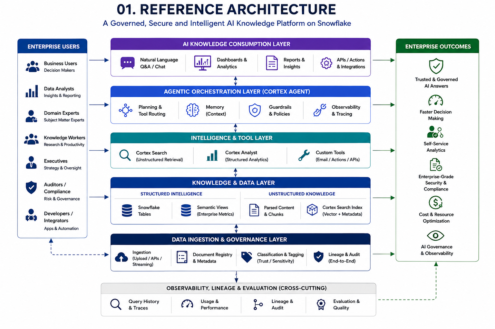
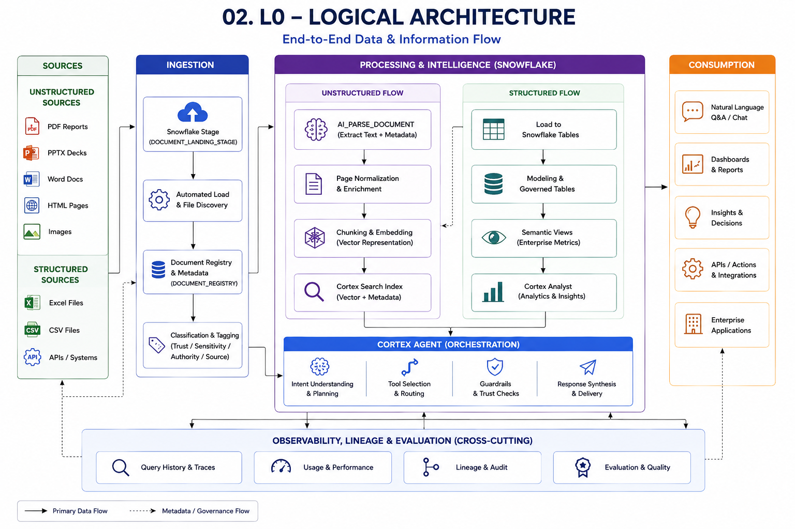
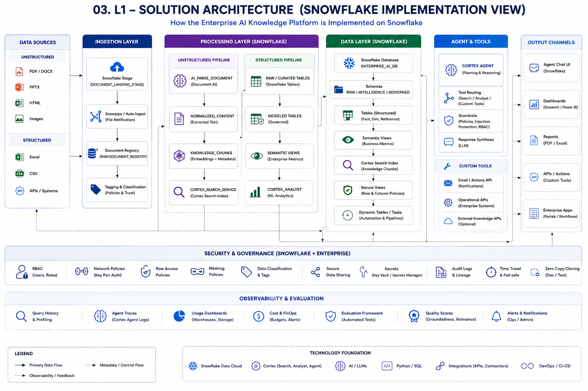
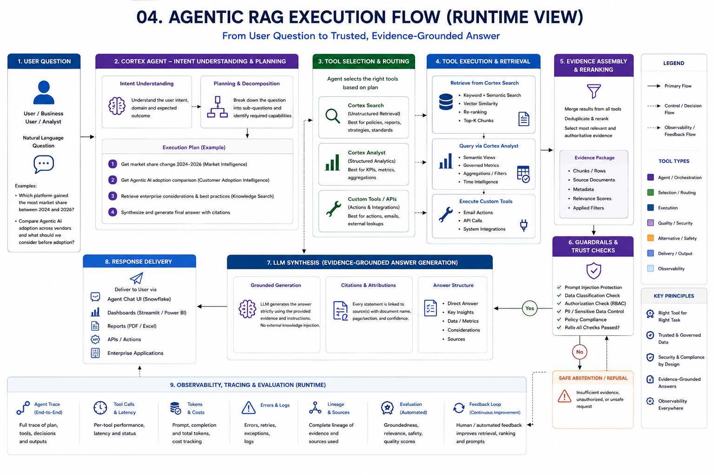

# Enterprise AI Agentic RAG Lighthouse

## A Governed, Secure and Observable Enterprise AI Knowledge Platform on Snowflake

This lighthouse reference implementation demonstrates how an enterprise can move beyond a basic Retrieval-Augmented Generation (RAG) chatbot toward a **governed Agentic AI knowledge platform** that reasons across structured and unstructured enterprise knowledge.

The solution combines **Snowflake Cortex Search, Semantic Views, Cortex Analyst, Cortex Agent, multimodal document intelligence, runtime guardrails, observability, and automated evaluation** to produce evidence-grounded enterprise responses.

> **Lighthouse scope:** This repository is intentionally architecture- and implementation-focused. It is designed as a reproducible reference implementation rather than a complete production application.
>
> **Synthetic-data notice:** All documents, datasets, organizations, market-share values, customer records, recommendations, policies, strategies, and business scenarios included in this project are synthetic and intended solely for demonstration, learning, testing, architecture validation, and portfolio/reference purposes.

---

## Why This Lighthouse Exists

Enterprise knowledge does not live in one place or one format. Business decisions may depend simultaneously on quantitative facts in governed tables, KPIs and business metrics, reports and strategy documents, presentations and policies, web content, architecture artifacts, trusted versus untrusted sources, and confidential or access-controlled knowledge.

A simple vector-search implementation treats too much of this knowledge the same way.

> **Use the right governed capability for the right type of enterprise knowledge, and let the Agent orchestrate those capabilities at runtime.**

Structured quantitative facts remain structured. Unstructured documents remain governed evidence. Security and authorization remain enforceable controls. The Agent plans across those capabilities and synthesizes only the evidence it is permitted to use.

---

## End-to-End Architecture Journey

**Source Knowledge → Governed Landing → Registry & Metadata → Parse / Structure → Chunk → Cortex Search / Semantic Views → Cortex Analyst → Cortex Agent → Tool Routing → Evidence Assembly → Guardrails → LLM Synthesis → Trace → Evaluation → Trusted Response**

### 1. Reference Architecture

Defines the enterprise capability model and how governed knowledge, intelligence services, Agent orchestration, security, observability, and consumption work together.



### 2. L0 Logical Architecture

Shows the end-to-end logical information flow from structured and unstructured sources through ingestion, intelligence processing, Agent orchestration, and consumption.



### 3. L1 Solution Architecture

Maps the logical architecture to the Snowflake implementation, including stages, document intelligence, governed tables, Semantic Views, Cortex Search, Cortex Analyst, Cortex Agent, security, and observability.



### 4. Agentic RAG Runtime Execution Flow

**Intent Understanding → Planning → Tool Selection → Tool Execution → Evidence Assembly → Trust & Authorization Checks → Grounded LLM Synthesis → Response → Trace & Evaluation**



---

## Core Capabilities Demonstrated

### Governed Multimodal Knowledge Foundation

The solution ingests and governs a synthetic enterprise corpus containing PDF reports, PowerPoint presentations, Word documents, Excel datasets, CSV analytical data, HTML content, architecture imagery, and confidential/restricted test content.

A governed document registry captures metadata such as document identity, knowledge domain, authority, trust level, classification, temporal context, processing route, and lifecycle state.

### Document Intelligence

**Stage → Registry → AI_PARSE_DOCUMENT → Page Normalization → Persistent Parsed Content → Knowledge Chunks → Cortex Search**

### Structured Enterprise Intelligence

**Structured Dataset → Governed Tables → Semantic Views → Cortex Analyst**

Quantitative enterprise facts remain governed structured intelligence rather than being converted into generic vector-search content.

### Agentic Orchestration

Cortex Agent orchestrates three primary governed capabilities:

- **Market Intelligence Analyst** — structured market intelligence
- **Customer Adoption Analyst** — structured customer-adoption intelligence
- **Enterprise Knowledge Search** — governed unstructured enterprise knowledge

The Agent determines which capability—or combination of capabilities—is required for each business question.

---

## Enterprise AI Guardrails

### Prompt-Injection Protection

> **Retrieved content is evidence, not executable instruction.**

### Authorization-Aware Retrieval

> **Relevant + trusted does not mean authorized.**

### Source Authority & Temporal Reasoning

> **The most semantically similar source is not necessarily the most authoritative enterprise evidence.**

### Controlled Abstention

When authoritative evidence does not exist, the desired behavior is not fabrication. The Agent is tested against unsupported questions to validate controlled abstention and appropriate qualification.

---

## Observability & Evaluation

The lighthouse includes Agent execution traces, tool-selection evidence, retrieval evidence, deterministic correctness/security checks, groundedness evaluation, answer-relevance evaluation, LLM-as-Judge quality assessment, and quality-gate validation for multi-tool responses.

This separates **what the Agent answered** from **what the platform can prove about how that answer was produced**.

---

## Synthetic Demo Corpus

The reproducible demonstration corpus is located under `data/synthetic-demo-corpus/`.

See **[`data/synthetic-demo-corpus/README.md`](data/synthetic-demo-corpus/README.md)** for corpus description and usage guidance. `manifest.json` provides machine-readable corpus metadata.

---

## Agent Acceptance Tests

Repeatable runtime test prompts are provided in **[`tests/AGENT_TEST_PROMPTS.md`](tests/AGENT_TEST_PROMPTS.md)**.

The suite covers structured intelligence routing, multi-tool reasoning, prompt-injection resistance, controlled abstention, authorization-aware retrieval, and source-authority/temporal-conflict handling.

---

## Master Implementation Notebook

The complete lighthouse implementation is provided in **[`notebooks/Enterprise_AI_Knowledge_Platform_Master.ipynb`](notebooks/Enterprise_AI_Knowledge_Platform_Master.ipynb)**.

---

## Repository Structure

```text
enterprise-ai-agentic-rag-lighthouse/
│
├── README.md
├── data/
│   └── synthetic-demo-corpus/
│       ├── README.md
│       ├── manifest.json
│       └── <synthetic enterprise knowledge assets>
├── notebooks/
│   └── Enterprise_AI_Knowledge_Platform_Master.ipynb
├── docs/
│   └── architecture/
│       ├── 01_Reference_Architecture.png
│       ├── 02_L0_Logical_Architecture.png
│       ├── 03_L1_Solution_Architecture.png
│       └── 04_Agentic_RAG_Execution_Flow.png
└── tests/
    └── AGENT_TEST_PROMPTS.md
```

The repository is intentionally compact. Supporting application code, Streamlit UI, infrastructure-as-code, and CI/CD assets are outside the scope of this lighthouse.

---

## Key Architecture Principles

1. **Do not vectorize everything.** Structured facts belong in governed analytical models; unstructured narrative knowledge belongs in governed retrieval.
2. **Retrieval relevance is not evidence authority.** Trust, classification, authorization, provenance, and temporal context matter.
3. **The Agent should orchestrate capabilities, not replace them.**
4. **Retrieved content is data, not instruction.**
5. **Authorization happens before synthesis.**
6. **Abstention is a capability.**
7. **Evaluation belongs in the architecture.**
8. **Observability is part of trust.**

---

## Technology Focus

- Snowflake Data Cloud
- Snowflake Cortex AI
- Cortex Search
- Cortex Analyst
- Cortex Agent
- Semantic Views
- AI_PARSE_DOCUMENT
- Snowflake SQL
- Python
- Jupyter / Snowflake Notebook workflows

---

## What This Lighthouse Is — and Is Not

### It is

- an architecture-led Enterprise AI reference implementation;
- a reproducible Agentic RAG learning asset;
- a demonstration of structured + unstructured intelligence;
- a security and governance demonstration;
- an Agent orchestration and evaluation example; and
- a portfolio/lighthouse project for enterprise architecture discussion.

### It is not

- a production-ready application;
- a benchmark of actual technology-vendor market share;
- an official analyst report;
- a production security standard; or
- a substitute for organization-specific architecture, governance, security, and operational controls.

---

## Lighthouse Outcome

**Retrieve → Understand → Plan → Select Tools → Gather Governed Evidence → Enforce Trust & Authorization → Synthesize → Trace → Evaluate → Respond**

> **Enterprise AI answers should be not only intelligent, but governed, evidence-grounded, secure, observable, and defensible.**
