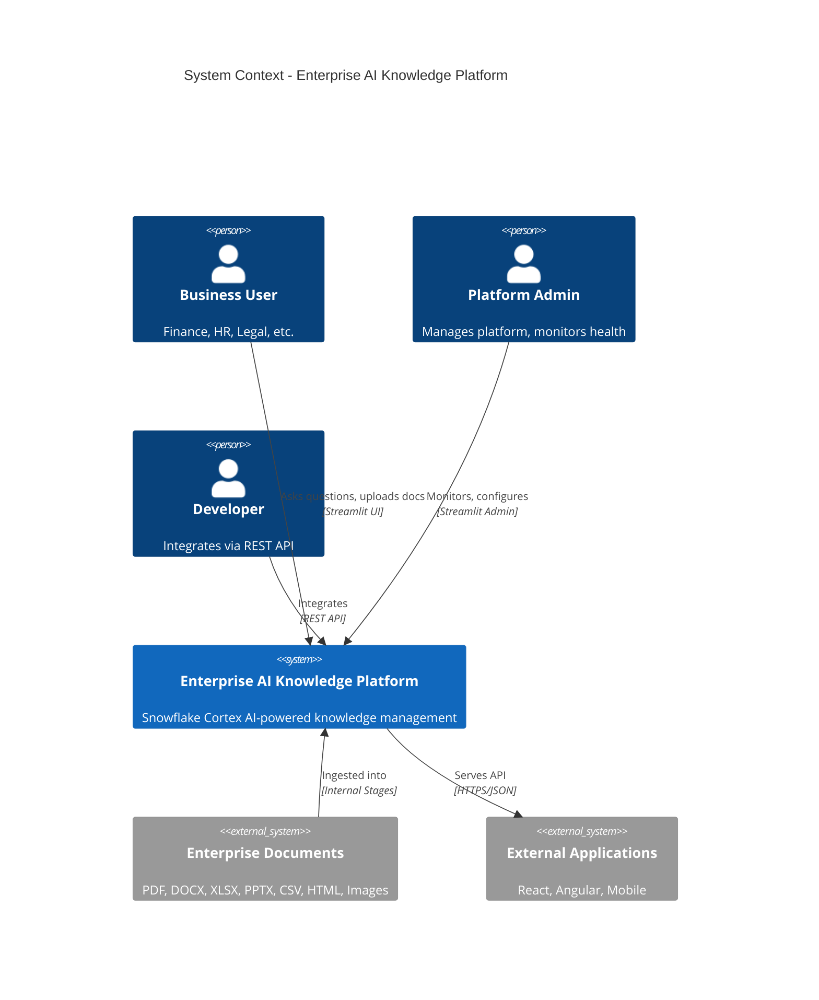
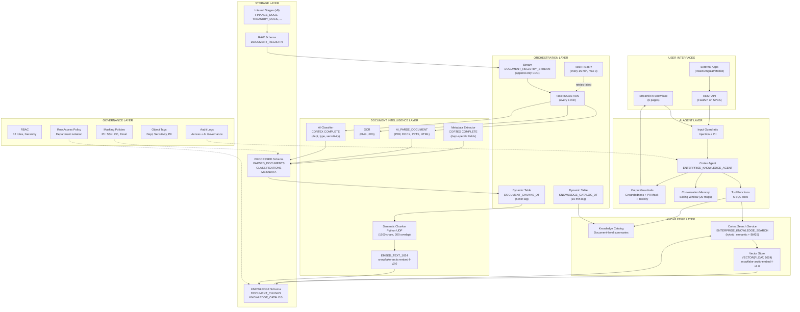
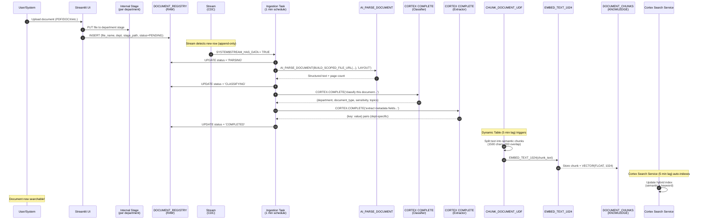
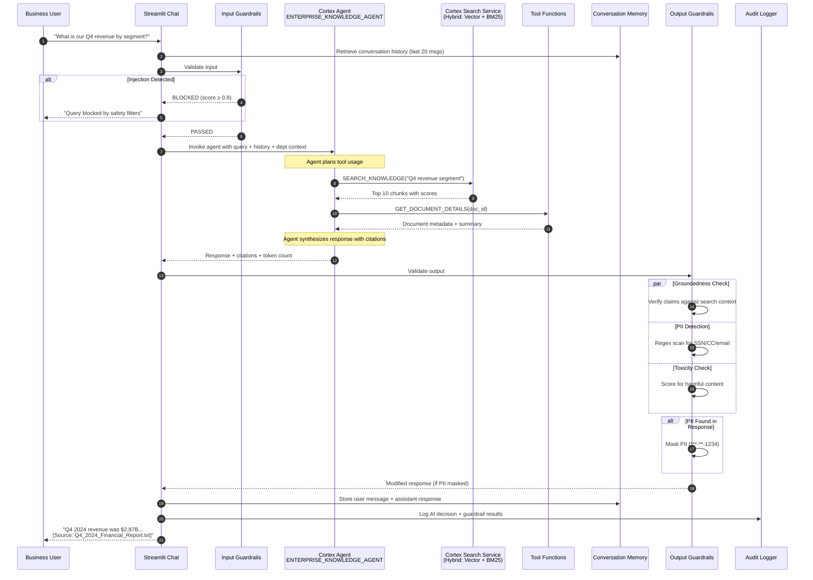
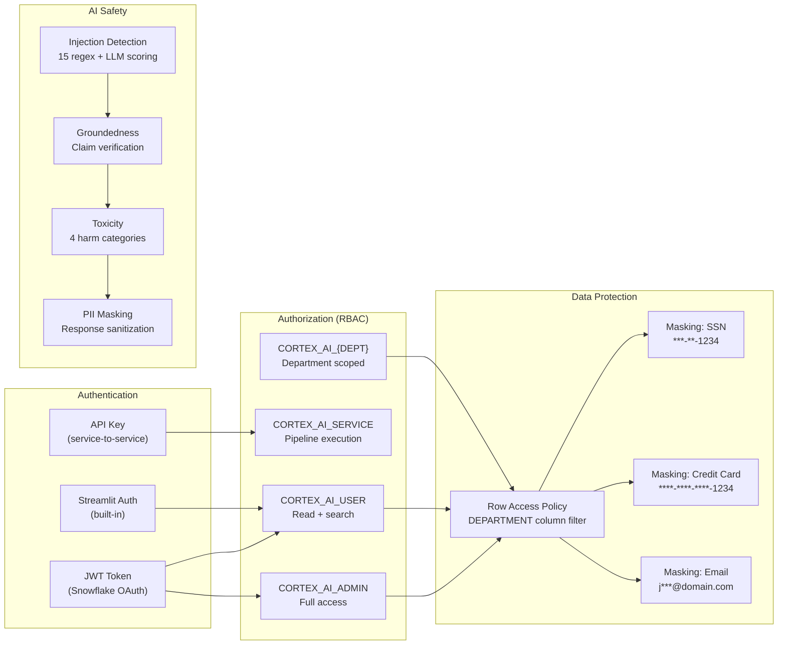
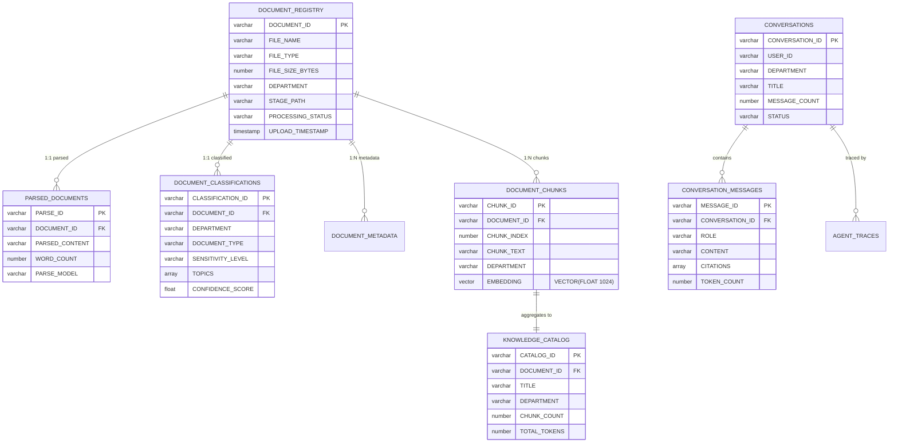
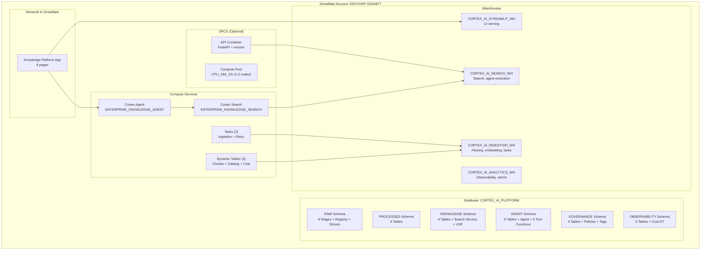
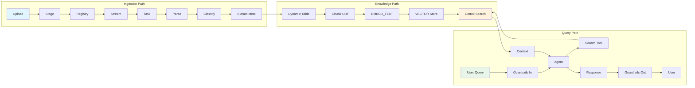

# Enterprise AI Knowledge Platform — Architecture Diagrams

## 1. System Context Diagram

## 2. High-Level Architecture

## 3. End-to-End Process Flow — Document Ingestion

## 4. End-to-End Process Flow — Query & Response

## 5. Security Architecture

## 6. Data Model (Entity Relationship)

## 7. Deployment Architecture

## 8. Component Interaction Map

