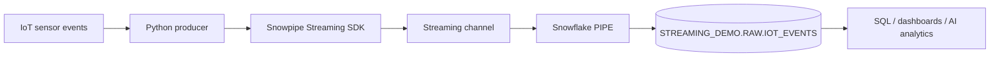

# Snowflake Snowpipe Streaming Demo

A complete, GitHub-ready demonstration of low-latency IoT event ingestion into Snowflake using the **Snowpipe Streaming high-performance Python SDK**, key-pair authentication, a named streaming pipe, offset tokens, and channel-based ingestion.

> Tested on Windows with Python 3.11 and `snowpipe-streaming==1.6.1`.

## What this demo shows

- Secure Snowflake key-pair authentication
- A dedicated Snowflake role and least-privilege grants
- A streaming target table and named PIPE object
- Python virtual-environment setup on Windows
- Channel-based ingestion with offset tokens
- Flush and graceful shutdown
- Data and channel-status verification
- Troubleshooting for the actual issues encountered during setup

## Architecture



## Repository structure

```text
snowpipe-streaming-demo/
├── README.md
├── LICENSE
├── SECURITY.md
├── .gitignore
├── requirements.txt
├── streaming.py
├── profile.example.json
├── sql/
│   ├── 01_create_role_and_user.sql
│   ├── 02_create_database_schema_table.sql
│   ├── 03_create_streaming_pipe.sql
│   ├── 04_grants.sql
│   └── 05_verify.sql
├── docs/
│   └── TROUBLESHOOTING.md
├── sample_data/
│   └── iot_events.json
├── images/
│   └── README.md
└── keys/
    └── README.md
```

## Prerequisites

- Snowflake account
- A role capable of creating users, roles, databases, schemas, tables, and pipes
- Python 3.11 recommended for this tested Windows setup
- OpenSSL
- Windows PowerShell

Confirm installed Python versions:

```powershell
py -0p
```

## 1. Clone and open the project

```powershell
git clone https://github.com/<YOUR_GITHUB_USERNAME>/snowpipe-streaming-demo.git
cd snowpipe-streaming-demo
```

## 2. Create the Python virtual environment

```powershell
py -3.11 -m venv .venv
.\.venv\Scripts\Activate.ps1
python --version
```

Expected:

```text
Python 3.11.x
```

If activation is blocked:

```powershell
Set-ExecutionPolicy -Scope CurrentUser RemoteSigned
.\.venv\Scripts\Activate.ps1
```

## 3. Install dependencies

```powershell
python -m pip install --upgrade pip setuptools wheel
python -m pip install -r requirements.txt
```

Verify the SDK:

```powershell
python -c "import snowflake.ingest.streaming as s; print(s.__version__)"
```

## 4. Generate the RSA key pair

```powershell
mkdir keys

openssl genrsa 2048 |
  openssl pkcs8 -topk8 -inform PEM -out keys\rsa_key.p8 -nocrypt

openssl rsa -in keys\rsa_key.p8 -pubout -out keys\rsa_key.pub
```

Never commit either key file. The repository `.gitignore` excludes them.

Extract the public-key body in PowerShell:

```powershell
$publicKey = (Get-Content .\keys\rsa_key.pub |
  Where-Object { $_ -notmatch 'BEGIN PUBLIC KEY|END PUBLIC KEY' }) -join ''

$publicKey
```

Copy that single-line value into `sql/01_create_role_and_user.sql`.

## 5. Configure Snowflake

Run the SQL scripts in numeric order from Snowsight:

1. `sql/01_create_role_and_user.sql`
2. `sql/02_create_database_schema_table.sql`
3. `sql/03_create_streaming_pipe.sql`
4. `sql/04_grants.sql`

The demo uses:

```text
Database: STREAMING_DEMO
Schema:   RAW
Table:    IOT_EVENTS
Pipe:     IOT_EVENTS_STREAMING
Role:     STREAMING_ROLE
User:     SUVENDU
```

Change these names when required, but keep the SQL and Python configuration aligned.

## 6. Create the local authentication profile

Copy the template:

```powershell
Copy-Item profile.example.json profile.json
```

Update `profile.json`:

```json
{
  "account": "YOUR_ORG-YOUR_ACCOUNT",
  "user": "YOUR_STREAMING_USER",
  "url": "https://YOUR_ORG-YOUR_ACCOUNT.snowflakecomputing.com:443",
  "private_key_file": "keys/rsa_key.p8",
  "role": "STREAMING_ROLE"
}
```

`profile.json` is excluded from Git.

## 7. Review the sample events

The file `sample_data/iot_events.json` contains three IoT events:

- temperature reading
- humidity alert
- temperature reading

The `payload` field is sent as a native Python dictionary and lands in a Snowflake `VARIANT` column.

## 8. Run the demo

```powershell
.\.venv\Scripts\Activate.ps1
python streaming.py
```

Expected application output:

```text
Channel opened successfully.
Sent event 0: sensor-001 - temperature_reading
Sent event 1: sensor-002 - humidity_alert
Sent event 2: sensor-003 - temperature_reading
Waiting for Snowflake commit...
All rows successfully flushed.
Streaming client closed.
```

The SDK also emits informational logs for authentication, pipe lookup, channel creation, storage, metrics, flush, and shutdown.

## 9. Verify the result in Snowflake

Run `sql/05_verify.sql`, or:

```sql
SELECT
    device_id,
    event_type,
    temperature,
    humidity,
    payload,
    ingested_at
FROM STREAMING_DEMO.RAW.IOT_EVENTS
ORDER BY ingested_at DESC;
```

## Offset-token behavior

The producer assigns monotonically increasing string tokens:

```python
offset_token=str(offset)
```

Offset tokens help an application track progress and safely resume ingestion. A just-flushed channel may briefly return `None` while channel-status metadata is being refreshed; this does not by itself mean the rows failed. Verify the target table and channel history as shown in `sql/05_verify.sql`.

## Security notes

- Never commit `profile.json`.
- Never commit `rsa_key.p8`.
- Never commit `rsa_key.pub`.
- Prefer a dedicated Snowflake service user for production.
- Rotate RSA keys periodically.
- Grant only the privileges required by the streaming application.
- Do not hardcode real account identifiers or user names in public repositories.

## Troubleshooting

See [docs/TROUBLESHOOTING.md](docs/TROUBLESHOOTING.md).

## Production enhancements

- Batch rows with `append_rows`
- Add bounded retries with exponential backoff
- Persist the latest acknowledged source offset
- Add structured logging and metrics
- Add dead-letter handling
- Integrate Kafka, MQTT, or CDC sources
- Add GitHub Actions for linting and security checks
- Monitor channel health through Snowflake channel history
- Add Dynamic Tables and Streamlit downstream

## References

- Snowflake Snowpipe Streaming high-performance SDK tutorial
- Snowflake Python SDK reference
- Snowflake PIPE object documentation
- Snowpipe Streaming operations and access privileges

## Author

**Suvendu Samal**  
Enterprise Data & AI Architect  
Snowflake · Databricks · Oracle · Enterprise AI
